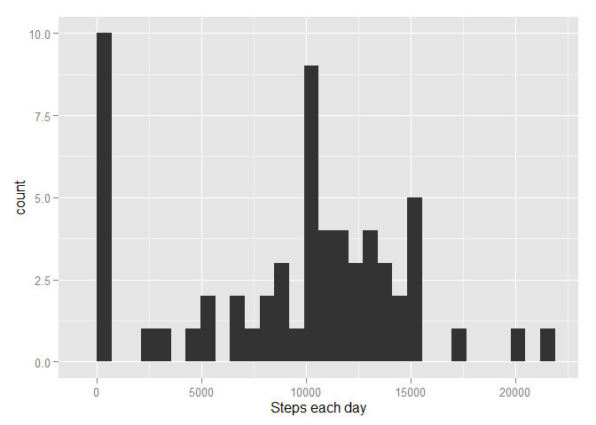
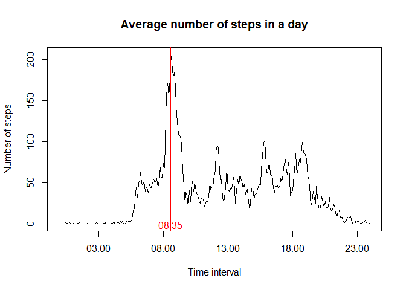
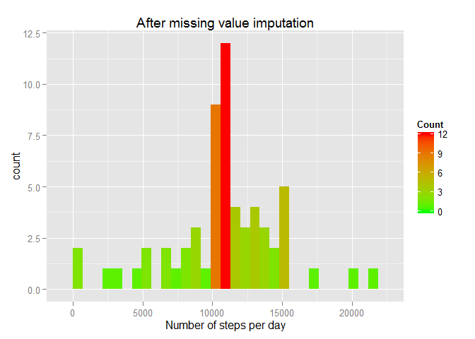
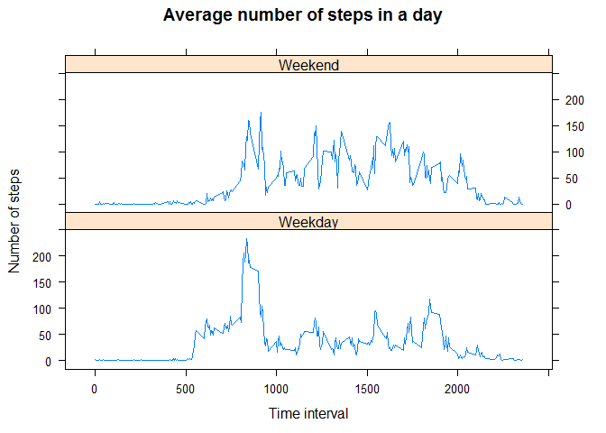

# Reproducible Research: Peer Assessment 1


## Loading and preprocessing the data
### Loading libraries Lubridate, Ggplot2 and Lattice
### Converting Interval to HH:MM format

```r
library(lubridate)
library(ggplot2)
```

```
## 
## Attaching package: 'ggplot2'
## 
## The following object is masked _by_ '.GlobalEnv':
## 
##     diamonds
```

```r
library(lattice)
acty <- read.csv("activity/activity.csv")
str_x <- formatC(acty$interval, width=4, flag="0")
str_y <- paste(substr(str_x, 1, 2), ":", substr(str_x, 3, 4), sep="")
acty$time <- hm(str_y)
```
## What is mean total number of steps taken per day?
### 1. Calculate the total number of steps taken per day:

```r
steps_each_day <- aggregate(acty$steps, list(Date = acty$date), sum, na.rm=TRUE)
```
### 2. Make a histogram of the total number of steps taken each day:

```r
qplot(steps_each_day$x, geom="histogram", xlab="Steps each day")
```

 

### 3.1 The mean of the total number of steps taken per day:

```r
steps_mean_each_day <- mean(steps_each_day$x, na.rm=TRUE)
steps_mean_each_day
```

```
## [1] 9354.23
```
### 3.2 The median of the total number of steps taken per day:

```r
steps_median_each_day <- median(steps_each_day$x, na.rm=TRUE)
steps_median_each_day
```

```
## [1] 10395
```

## What is the average daily activity pattern?
### 1. Make a time series plot (i.e. type = "l") of the 5-minute interval (x-axis) and the average number of steps taken, averaged across all days (y-axis)
### 2. Which 5-minute interval, on average across all the days in the dataset, contains the maximum number of steps?


```r
steps_mean_interval <- aggregate(acty$steps, list(interval = acty$interval),
    mean, na.rm=TRUE)
str_x <- formatC(steps_mean_interval$interval, width=4, flag="0")
str_y <- paste(substr(str_x, 1, 2), ":", substr(str_x, 3, 4), sep="")
steps_mean_interval$time <- strptime(str_y, "%H:%M")
plot(steps_mean_interval$time, steps_mean_interval$x, type = "l",
    main="Average number of steps in a day",
    xlab="Time interval", ylab="Number of steps")
max_steps <- subset(steps_mean_interval, x==max(steps_mean_interval$x))
abline(v=as.numeric(max_steps$time), col="red")
text(as.numeric(max_steps$time), -1, format(max_steps$time, format="%H:%M"),
  col="red")
```

 

## Imputing missing values
### 1. Calculate and report the total number of missing values in the dataset (i.e. the total number of rows with NAs)

```r
sum(is.na(acty$steps))
```

```
## [1] 2304
```
### 2. Devise a strategy for filling in all of the missing values in the dataset. The strategy does not need to be sophisticated. For example, you could use the mean/median for that day, or the mean for that 5-minute interval, etc.
### My strategy: For each interval, if the step is NA then assign the mean value of same interval of the day to replace the missing value.
### 3. Create a new dataset that is equal to the original dataset but with the missing data filled in.


```r
new_acty <- acty
for (i in 1:nrow(new_acty)) {
  if (is.na(new_acty[i, "steps"])) {
    new_acty[i, "steps"] <-
      steps_mean_interval$x[steps_mean_interval$interval==new_acty[i,"interval"]]
  }
}
```
### 4.1 Make a histogram of the total number of steps taken each day


```r
new_steps_each_day <- aggregate(new_acty$steps, list(Date = new_acty$date), sum)
m <- ggplot(new_steps_each_day, aes(x=x))
m + geom_histogram(aes(fill = ..count..)) +
  scale_fill_gradient("Count", low = "green", high = "red") +
  xlab("Number of steps per day") +
  ggtitle("After missing value imputation")
```

 
### 4.2 Calculate and report the mean total number of steps taken per day.

```r
new_steps_mean_each_day <- mean(new_steps_each_day$x)
new_steps_mean_each_day
```

```
## [1] 10766.19
```
### 4.2 Calculate and report the median total number of steps taken per day.

```r
new_steps_median_each_day <- median(new_steps_each_day$x)
new_steps_median_each_day
```

```
## [1] 10766.19
```
### 4.3 Do these values differ from the estimates from the first part of the assignment? Yes
### 4.3 What is the impact of imputing missing data on the estimates of the total daily number of steps? The mean and median change
### 

## Are there differences in activity patterns between weekdays and weekends?
### 1. Create a new factor variable in the dataset with two levels - "weekday" and "weekend" indicating whether a given date is a weekday or weekend day.


```r
acty$days <- "NoDay"
for (i in 1:nrow(acty)) {
  if (weekdays(as.POSIXct(acty[i, "date"])) %in% c("Saturday", "Sunday")) {
    acty[i, "days"] <- "Weekend"
  } else {
    acty[i, "days"] <- "Weekday"
  }
}
```
### 2. Make a panel plot containing a time series plot (i.e. type = "l") of the 5-minute interval (x-axis) and the average number of steps taken, averaged across all weekday days or weekend days (y-axis).


```r
steps_mean_interval_weekend_weekday <- aggregate(acty$steps,
    list(interval = acty$interval, days = acty$days), mean, na.rm=TRUE)
steps_mean_interval_weekend_weekday <-
  transform(steps_mean_interval_weekend_weekday, days=factor(days))
xyplot(x~interval | days,
    data=steps_mean_interval_weekend_weekday,
    type="l",
    layout=c(1,2),
    main="Average number of steps in a day",
    xlab="Time interval",
    ylab="Number of steps")
```

 
